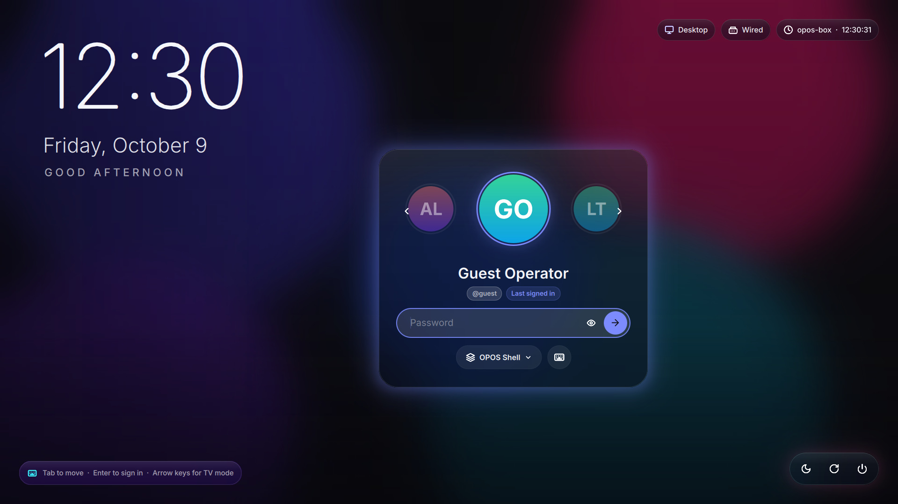

# OPOS Greeter — SDDM theme

A Qt 6 SDDM login theme that matches OPOS Shell. It has an obsidian base with acrylic glass panels, a large clock, and one login screen that adapts to a **TV remote**, a **touchscreen** or a **mouse and keyboard**.



## Install (Fedora)

```bash
# Theme only (prints the dnf command if SDDM or Qt modules are missing)
sudo ./scripts/install-greeter.sh

# Also install SDDM and the Qt 6 modules, switch the display manager, and register the OPOS Shell session
sudo ./scripts/install-greeter.sh --install-deps --enable-sddm --with-session
```

What the installer does:

1. Checks for `sddm` and `sddm-greeter-qt6`. If they're missing it prints  
   `sudo dnf install sddm qt6-qtdeclarative qt6-qtsvg qt6-qtvirtualkeyboard qt6-qtmultimedia rsms-inter-fonts`  
   (or runs it with `--install-deps`, or after you confirm at an interactive prompt).
2. Copies `greeter/opos-greeter/` to `/usr/share/sddm/themes/opos-greeter`, keeping any `theme.conf.user` override and restoring SELinux labels.
3. Writes `[Theme] Current=opos-greeter` into `/etc/sddm.conf.d/theme.conf`. If the file already exists it is backed up first, and only `Current=` inside `[Theme]` is changed. It also warns if a file SDDM reads later would override the setting (for example Plasma's `kde_settings.conf` or `/etc/sddm.conf`).
4. Writes `/etc/sddm.conf.d/zz-opos-greeter.conf` with:
   - `InputMethod=qtvirtualkeyboard`, which powers the on-screen keyboard.
   - `GreeterEnvironment=QML_XHR_ALLOW_FILE_READ=1`, which lets the theme read `/sys/class/power_supply` and `/proc/net/wireless` for the battery and Wi-Fi pills. Any existing `GreeterEnvironment` values are merged in.
5. With `--with-session`, adds an **OPOS Shell** Wayland session to the session picker. It runs the Electron shell fullscreen in the [`cage`](https://github.com/cage-kiosk/cage) kiosk compositor. Set `OPOS_DIR` in `/usr/local/bin/opos-session` to point at your build; the default is `/opt/opos-shell`.

`sudo ./scripts/install-greeter.sh --uninstall` reverses all of this.

## Preview without logging out

```bash
# From the repo (no install, no root):
./scripts/install-greeter.sh --test

# Equivalent manual command (installed copy):
QML_XHR_ALLOW_FILE_READ=1 QT_IM_MODULE=qtvirtualkeyboard \
  sddm-greeter-qt6 --test-mode --theme /usr/share/sddm/themes/opos-greeter
```

On SDDM builds older than 0.21 the greeter binary is `sddm-greeter` and is Qt 5, which this theme does not support. In test mode the power buttons and login are not carried out.

No SDDM available? `scripts/preview-greeter-mock.py` renders the theme with PySide6 and mocked SDDM objects (password `opos` succeeds).

## Input model

| Mode | Triggered by | Behaviour |
|---|---|---|
| Desktop | Mouse movement or a click | Hover states, click ripples, thin focus rings once you navigate with Tab |
| Touch | Any touchscreen contact | Larger targets (×1.12), keyboard toggle, password field opens the on-screen keyboard |
| TV | 2 consecutive Arrow/Enter presses (`tvKeyThreshold`) | Mouse cursor hidden; the focused element scales up with an electric glow; full D-pad map |

D-pad map: **◀ ▶** switch user · **▼** user → password → session/keyboard → power bar · **▲** back up · **OK** sign in / activate · **BACK** (Esc / remote Back) closes a dialog, hides the keyboard, clears the password, then refocuses the password field. Power actions always open a confirmation dialog, and focus starts on **Cancel**.

The on-screen keyboard toggle calls `Qt.inputMethod.show()`, so it works with Qt Virtual Keyboard (set up by the installer) and with other Qt input-method plugins such as Maliit on a Wayland greeter.

## Configuration (`theme.conf`, or `theme.conf.user` to override)

| Key | Default | Notes |
|---|---|---|
| `background` | `aurora` | `aurora` (animated OPOS gradient), an image path, or a video path (`.mp4/.webm/.mov/.mkv`) for an aerial loop; falls back to aurora on error |
| `backgroundDim` | `0.35` | Darkening over images and videos |
| `accentColor` / `accentColor2` / `accentColor3` / `baseColor` | `#7c8cff` / `#f472b6` / `#22d3ee` / `#0a0a0f` | Palette |
| `font` | `Inter` | Falls back to the system sans-serif |
| `clockFormat` / `dateFormat` | `HH:mm` / `dddd, MMMM d` | Qt format strings |
| `showGreeting`, `showHostname`, `showBattery`, `showNetwork` | `true` | |
| `tvKeyThreshold` | `2` | Consecutive arrow/enter presses that switch to TV mode |
| `blurMax` | `64` | Strength of the glass blur |

## Requirements

SDDM ≥ 0.21 with the Qt 6 greeter, and Qt ≥ 6.5 (the glass and glow effects use `QtQuick.Effects`, available on Fedora 39 and later). Optional: `qt6-qtvirtualkeyboard` for the on-screen keyboard, `qt6-qtmultimedia` for video backgrounds, `rsms-inter-fonts` for the Inter typeface.

## Layout

```
greeter/opos-greeter/
  metadata.desktop      SDDM theme metadata (QtVersion=6)
  theme.conf            defaults
  Main.qml              layout, login flow, power confirmation, input-mode detection
  preview.png
  components/
    Ui.qml (singleton)  palette, sizing, input model + shared D-pad navigation
    GlassPanel.qml      acrylic blur + tint + neon ambient glow
    Background.qml      aurora / image / video backdrop (AuroraBackground, BackgroundVideo)
    Clock.qml           large clock, date and greeting
    StatusPills.qml     mode · network · battery · host + time (SystemStatus.qml reads sysfs)
    UserSelector.qml    avatar carousel (Avatar.qml, Badge.qml)
    PasswordBox.qml     glass input, reveal toggle, unlock arrow, Caps Lock warning
    SessionPicker.qml   session dropdown
    PowerBar.qml        sleep / restart / shut down pill
    ConfirmDialog.qml   power confirmation modal
    ModeHint.qml        input-mode hint chip
    OposButton.qml      shared button (hover, ripple, TV glow) + FocusGlow, Ripple, Icon, ToolTipBubble
    VirtualKeyboard.qml Qt Virtual Keyboard panel (loaded on demand)
  assets/icons/*.svg    line icons
greeter/session/        OPOS Shell Wayland session (.desktop + cage launcher)
```
